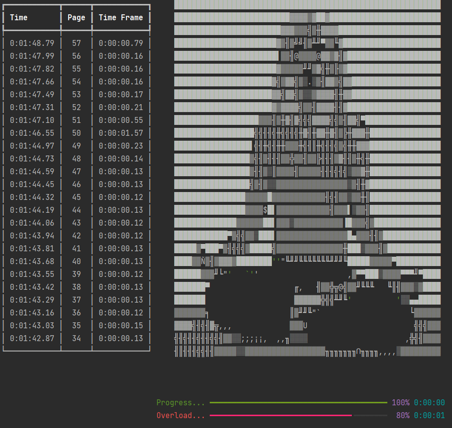

*******************************
Chronometria Paginarum (v. 0.2)
*******************************

A CLI application to store and evaluate effectiveness and distraction rate while reading books.

Reverse Jenga (with Taico)
##########################

Taico invites you to play a game of Reverse Jenga.

Rules
-----

.. container::
    Instead of removing tiles from a tower, you pile books on top of each other.

    The match is set with a *page threshold*.

    If the Jenga tower falls and the player has an average of pages read per day
    greater or equal to the page threshold, the player wins.

    Page threshold should be a number the player feels comfortable with.

    If the average number of pages reaches a number lower than the page threshold,
    the player is offered 7 days for redemption.
    If the average is still lower than the page threshold after that, the player loses.

    For beginners, a fallback of 150 pages is set. Adding it to your tracker before the game starts will allow
    more flexibility during the game.

    Winning the game grants no reward. Losing it presents no penalties.

*****
Setup
*****

The system only has the tracker currently.

The sessions are played in a terminal.

The data dashboard will be available in a local web app (WIP Dash Plotly).

Current goals
#############
1. Adding basic statistics
2. Save and load data
3. Reverse Jenga matches
4. Dialogue
5. Allow step back (re-do page count last instance) [backlog]

First setup
###########

1. Setup poetry.
    1.1 - In PowerShell, run:
        (Invoke-WebRequest -Uri
        https://raw.githubusercontent.com/python-poetry/poetry/master/get-poetry.py
        -UseBasicParsing).Content | python -
    1.2 - At main folder, run: *poetry install*
2. Run tests.
    2.1 - In main folder, run: *poetry run pytest*
